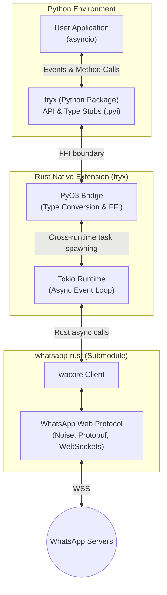

# Tryx

[](https://github.com/krypton-byte/tryx/actions/workflows/CI.yml)
[](https://github.com/krypton-byte/tryx/actions/workflows/release.yml)
[](http://krypton-byte.tech/tryx/)
[](https://www.python.org/)
[](https://www.rust-lang.org/)
[](https://peps.python.org/pep-0561/)
[](LICENSE)

Tryx is a Rust-powered Python SDK for building WhatsApp automations. It bridges Python's `asyncio` and Rust's `tokio` through PyO3, giving you a typed, async-first API backed by a native protocol core.

It combines:

- **Rust** for the WhatsApp Web protocol, Signal encryption, and async I/O
- **PyO3** for zero-overhead Python ↔ Rust type conversion
- **Tokio** for the async runtime that drives connections and event dispatch
- **Pluggable storage** — built-in SQLite, native FFI (Postgres, etc.), or pure-Python custom backends
- **PEP 561 typing** — full `.pyi` stubs and `py.typed` marker for editor and type-checker support

> Note: This project is an independent developer SDK and is not affiliated with WhatsApp or Meta.

## Why Tryx

- **Async-first** — event-driven architecture with `@app.on(EventType)` handlers and native `async/await`
- **Pluggable storage** — 3-tier backend system: built-in SQLite for zero-config, native C-ABI shared libraries for maximum throughput, or pure-Python `StoreBase` subclasses for custom databases (Redis, MongoDB, DynamoDB, etc.)
- **Decoupled backends** — third-party storage packages (like `tryx-store-postgres`) don't depend on Tryx at all; they just expose a standard interface
- **Low-overhead Python bridge** — the Rust core uses `Python::attach` (PyO3 0.28+) with GIL released during I/O, keeping bridge overhead at microseconds per call
- **Typed everywhere** — namespace-based client API (`contact`, `groups`, `polls`, etc.) with full type stubs, so your editor catches errors before runtime
- **Both runtime styles** — `await app.run()` for async applications, `app.run_blocking()` for simple scripts

## Architecture

Tryx acts as an interoperability layer (using **PyO3**) between Python's `asyncio` and Rust's `tokio` runtimes. It wraps the powerful `whatsapp-rust` core library, converting low-level Rust structs into ergonomic, strongly-typed Python objects without sacrificing performance.



## Quick Links

- Documentation: http://krypton-byte.tech/tryx/
- Contributing Guide: [CONTRIBUTING.md](CONTRIBUTING.md)
- Command Automation Example: [examples/command_bot.py](examples/command_bot.py)

## Installation

### Prerequisites

- Python 3.8+
- Rust stable toolchain
- `uv`

### Development Install (Editable)

```bash
uv sync --group dev
uv run maturin develop
```

### Build Wheels

```bash
uv run maturin build --release
```

## Quick Start

```python
import asyncio
from tryx.backend import SqliteStore
from tryx.client import Tryx, TryxClient
from tryx.events import EvMessage
from tryx.waproto.whatsapp_pb2 import Message

backend = SqliteStore("whatsapp.db")
app = Tryx(backend)

@app.on(EvMessage)
async def on_message(client: TryxClient, event: EvMessage) -> None:
    text = event.data.get_text() or "<non-text>"
    chat = event.data.message_info.source.chat
    await client.send_message(chat, Message(conversation=f"Echo: {text}"))

async def main() -> None:
    await app.run()

if __name__ == "__main__":
    asyncio.run(main())
```

## Storage Backends

Tryx supports 3 storage tiers — pick the right one for your use case:

| Tier | Backend | Overhead | Use case |
|------|---------|----------|----------|
| Built-in | `SqliteStore` | Zero | Default / prototyping |
| Native FFI | `FfiStoreProtocol` | Near-zero | Max throughput (Postgres, custom C) |
| Pure Python | `StoreBase` | Low | Redis, MongoDB, or any async DB |

```python
# Tier 1: Built-in SQLite (default)
from tryx.backend import SqliteStore
app = Tryx(SqliteStore("whatsapp.db"))

# Tier 2: Native FFI (e.g. tryx-store-postgres)
app = Tryx(PostgresStore(lib_path="./libtryx_pg.so", connect_string="..."))

# Tier 3: Pure Python custom backend
from tryx.backend import StoreBase

class RedisStore(StoreBase):
    async def put_identity(self, address: str, key: bytes) -> None:
        await self.redis.set(f"identity:{address}", key)
    # ... implement all abstract methods ...

app = Tryx(RedisStore())
```

For the full API specification, JSON schemas, and implementation guide, see [Storage Backends](docs/core-concepts/storage-backends.md).

## Feature Overview

- Event-based handlers via `@app.on(...)`
- Runtime client namespaces:
  - `contact`, `chat_actions`, `community`, `newsletter`, `groups`
  - `status`, `chatstate`, `blocking`, `polls`, `presence`, `privacy`, `profile`
- Media upload/download and message sending helpers
- Typed helper utilities under `tryx.helpers`

For complete API coverage, see the docs site and generated API pages.

## Project Layout

- `src/`: Rust core bindings and runtime integration
- `python/tryx/`: Python package surface and type stubs
- `python/tryx/waproto/`: generated protobuf Python modules
- `examples/`: runnable usage examples
- `docs/`: MkDocs sources

## Development Workflow

```bash
# Lint and format check
uv run ruff check .
uv run ruff format --check .

# Validate stubs
uv run python scripts/check_stub_parity.py

# Build docs locally
uv sync --group docs
uv run mkdocs serve
```

## Release Workflow (Maintainers)

- Release is triggered manually via GitHub Actions (`Semantic Release`).
- Version bump is automatic from Conventional Commits:
  - `feat` -> minor
  - `fix` / `perf` -> patch
  - breaking change -> major
- The workflow creates a Git tag (`vX.Y.Z`), creates a GitHub Release, then triggers CI for publish.

## Troubleshooting

### Native Module Import Error

If you see `ModuleNotFoundError: No module named 'tryx._tryx'`:

```bash
uv run maturin develop --release
```

### Client Not Running

Ensure the client runtime is started (`run` or `run_blocking`) before calling runtime client methods.

## Contributing

See [CONTRIBUTING.md](CONTRIBUTING.md) for contribution and release guidelines.

## License

This project is licensed under the terms in [LICENSE](LICENSE).
