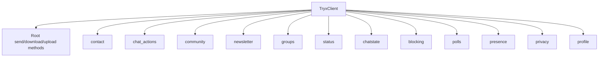

# Client API Gateway

`TryxClient` is the runtime facade passed to every handler, and it exposes a root messaging surface plus 12 namespace clients.

!!! tip "How To Read This Section"
	1. Start with this gateway page.
	2. Open the namespace page that matches your task.
	3. Jump to [Events API](events.md) for event contracts and [Types API](types.md) for enum/value-object constraints.

## Client Topology

## Namespace Router

[Contact Namespace](contact.md)

Find users, check registration state, and fetch profile pictures.

[Chat Actions Namespace](chat-actions.md)

Archive, pin, mute, read-state, edit/revoke/react operations.

[Community Namespace](community.md)

Create and manage communities with linked subgroups.

[Newsletter Namespace](newsletter.md)

Join, manage, post, and read newsletter channels.

[Groups Namespace](groups.md)

Group lifecycle, membership approval, and participant administration.

[Status Namespace](status.md)

Post/revoke statuses and manage status audience privacy.

[Chatstate Namespace](chatstate.md)

Typing and recording state signaling.

[Blocking Namespace](blocking.md)

Blocklist management and identity checks.

[Polls Namespace](polls.md)

Poll creation, encrypted vote operations, and tally aggregation.

[Presence Namespace](presence.md)

Presence state updates and subscription controls.

[Privacy Namespace](privacy.md)

Privacy categories, values, and disallowed-list updates.

[Profile Namespace](profile.md)

Push name, status text, and profile picture lifecycle.

## Root Transport Methods

These methods stay on `TryxClient` directly because they are cross-domain primitives.

| Method | Purpose | Typical usage |
| --- | --- | --- |
| `is_connected() -> bool` | Connection health check | Guard before sends in long-running jobs |
| `download_media(message) -> bytes` | Download media blob from message proto media node | Save image/audio/document payloads |
| `upload_file(path, media_type) -> UploadResponse` | Upload file path for later message/status usage | Status media workflows |
| `upload(data, media_type) -> UploadResponse` | Upload in-memory bytes | Transform pipelines |
| `send_message(to, message) -> SendResult` | Raw protobuf message send | Advanced custom payloads |
| `send_text(...) -> SendResult` | Text helper | Most command handlers |
| `send_photo(...) -> SendResult` | Image helper | Bot replies with screenshots/posters |
| `send_document(...) -> SendResult` | File helper | Reports, exports, invoices |
| `send_audio(...) -> SendResult` | Audio helper | Voice notes / TTS |
| `send_video(...) -> SendResult` | Video helper | Clips, demos |
| `send_gif(...) -> SendResult` | GIF helper | Motion responses |
| `send_sticker(...) -> SendResult` | Sticker helper | Lightweight reactions |
| `request_media_reupload(...) -> MediaReuploadResult` | Recover stale media references | Retry failed media downloads |

!!! warning "Reconnect-safe Pattern"
	Avoid caching `TryxClient` on global module state across runtime restarts.
	Always use the `client` object injected in the current handler call.

## Practical Flow By Goal

=== "Message Bot"
	Use root send methods + `chat_actions` + `chatstate`.

	1. Parse incoming event.
	2. Signal typing with `client.chatstate.send_composing(chat)`.
	3. Send reply with `client.send_text(...)`.
	4. Optional message edit/revoke via `client.chat_actions`.

=== "Moderation Bot"
	Use `groups`, `blocking`, `privacy`.

	1. Resolve sender via [Types API](types.md).
	2. Apply participant actions (`promote`, `remove`, `approve request`).
	3. Enforce policy with blocklist/privacy settings.

=== "Broadcast/Channel Bot"
	Use `status`, `newsletter`, `polls`.

	1. Upload content or build text payload.
	2. Publish status/newsletter message.
	3. Track engagement using polls and reactions.

## Cross-References

- Event contracts: [Events API](events.md)
- Shared value objects: [Types API](types.md)
- Builders and utility helpers: [Helpers API](helpers.md)
- End-to-end bot composition: [Tutorial: Command Bot](../tutorials/command-bot.md)
