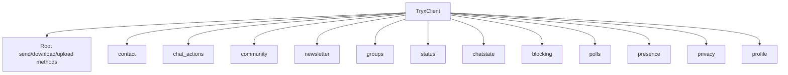

# Client API Gateway

::: tryx.client.Tryx
    options:
      show_root_heading: true
      heading_level: 2

---

`TryxClient` is the runtime facade passed to every handler, and it exposes
a root messaging surface plus 12 namespace clients.

!!! tip "How to read this section"
    1. Start with this gateway page.
    2. Open the namespace page that matches your task.
    3. Jump to [Events API](events.md) for event contracts and
       [Types API](types.md) for enum/value-object constraints.

## Client Topology

```mermaid
flowchart TD
    A[TryxClient] --> B[Root send/download/upload methods]
    A --> C[contact]
    A --> D[chat_actions]
    A --> E[community]
    A --> F[newsletter]
    A --> G[groups]
    A --> H[status]
    A --> I[chatstate]
    A --> J[blocking]
    A --> K[polls]
    A --> L[presence]
    A --> M[privacy]
    A --> N[profile]
```

## Namespace Router

[**Contact**](contact.md){ .md-link }
Find users, check registration state, fetch profile pictures

[**Chat Actions**](chat-actions.md){ .md-link }
Archive, pin, mute, read-state, edit/revoke/react

[**Groups**](groups.md){ .md-link }
Group lifecycle, membership approval, participant admin

[**Community**](community.md){ .md-link }
Community creation, subgroup management

[**Newsletter**](newsletter.md){ .md-link }
Channel subscription, posting, follower management

[**Status**](status.md){ .md-link }
Status updates with privacy controls

[**Chatstate**](chatstate.md){ .md-link }
Typing and recording indicators

[**Blocking**](blocking.md){ .md-link }
Block/unblock and blocklist queries

[**Polls**](polls.md){ .md-link }
Encrypted poll creation and vote aggregation

[**Presence**](presence.md){ .md-link }
Online/offline presence and subscriptions

[**Privacy**](privacy.md){ .md-link }
Privacy settings and disallowed lists

[**Profile**](profile.md){ .md-link }
Push name, status text, profile picture

---

## Root Transport Methods

These methods stay on `TryxClient` directly because they are cross-domain
primitives.

| Method | Purpose | Typical Usage |
|--------|---------|---------------|
| `is_connected()` | Connection health check | Guard before sends |
| `download_media(message)` | Download media blob | Save image/audio/document |
| `upload_file(path, media_type)` | Upload file for later use | Status media workflows |
| `upload(data, media_type)` | Upload in-memory bytes | Transform pipelines |
| `send_message(to, message)` | Raw protobuf send | Advanced custom payloads |
| `send_text(...)` | Text helper | Most command handlers |
| `send_photo(...)` | Image helper | Replies with screenshots |
| `send_document(...)` | File helper | Reports, exports |
| `send_audio(...)` | Audio helper | Voice notes / TTS |
| `send_video(...)` | Video helper | Clips, demos |
| `send_gif(...)` | GIF helper | Motion responses |
| `send_sticker(...)` | Sticker helper | Lightweight reactions |
| `request_media_reupload(...)` | Recover stale media | Retry failed downloads |

!!! warning "Reconnect-safe pattern"
    Avoid caching `TryxClient` on global module state across runtime
    restarts. Always use the `client` object injected in the current
    handler call.

---

## Practical Flow by Goal

=== "Message Client"

    Use root send methods + `chat_actions` + `chatstate`.

    1. Parse incoming event.
    2. Signal typing with `client.chatstate.send_composing(chat)`.
    3. Send reply with `client.send_text(...)`.
    4. Optional message edit/revoke via `client.chat_actions`.

=== "Moderation Client"

    Use `groups`, `blocking`, `privacy`.

    1. Resolve sender via [Types API](types.md).
    2. Apply participant actions (`promote`, `remove`, `approve request`).
    3. Enforce policy with blocklist/privacy settings.

=== "Broadcast/Channel Client"

    Use `status`, `newsletter`, `polls`.

    1. Upload content or build text payload.
    2. Publish status/newsletter message.
    3. Track engagement using polls and reactions.

---

## Cross-References

- Event contracts: [Events API](events.md)
- Shared value objects: [Types API](types.md)
- Builders and utility helpers: [Helpers API](helpers.md)
- End-to-end client composition: [Tutorial: Command Automation](../tutorials/command-bot.md)
