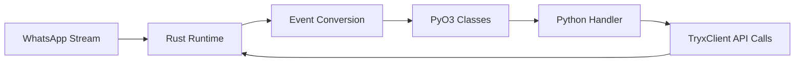

# Architecture

Tryx intentionally splits protocol-heavy runtime responsibilities and Python-facing ergonomics.

## Layered Design

Tryx uses a two-layer model:

1. Rust core layer
2. Python API layer

### Rust Core Layer

The Rust side handles:

- protocol parsing
- transport/runtime state
- heavy event transformations
- media and protobuf conversions

Additional responsibilities:

- connection lifecycle and stream state
- event normalization and serialization boundaries
- low-level protocol node handling

### Python API Layer

The Python side provides:

- ergonomic async API
- namespace-based clients (`contact`, `groups`, `privacy`, etc.)
- typed stubs for IDE and static analysis
- callback registration via decorators

Additional responsibilities:

- namespace-driven domain APIs (`client.groups`, `client.privacy`, etc.)
- handler orchestration and business logic composition
- integration with third-party systems (DB, queues, APIs)

## Why This Design Works

- Performance-sensitive logic stays in Rust.
- Product logic stays simple in Python.
- Event payloads are structured classes, not ad-hoc dicts.

## Runtime Boundary Principle

!!! tip
    Keep protocol assumptions in Rust-backed typed models and keep product/business policy in Python handlers.

## Data Flow

## Module Map

- `src/lib.rs`: submodule registration and class exports
- `src/clients/*`: client methods exposed to Python
- `src/events/*`: event classes and dispatcher
- `src/types.rs`: shared data classes (`JID`, `MessageInfo`, etc.)
- `src/wacore/*`: low-level node and stanza models
- `python/tryx/*.py`: runtime re-export wrappers
- `python/tryx/*.pyi`: typed API contracts

## Practical Implication

You can safely treat Python classes as stable contracts while trusting Rust internals for throughput and protocol-heavy work.

## Related Docs

- [Event Model](event-model.md)
- [Type System](type-system.md)
- [Client API Gateway](../api/client.md)
