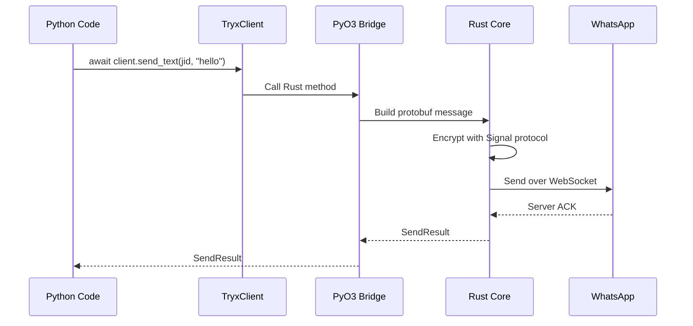
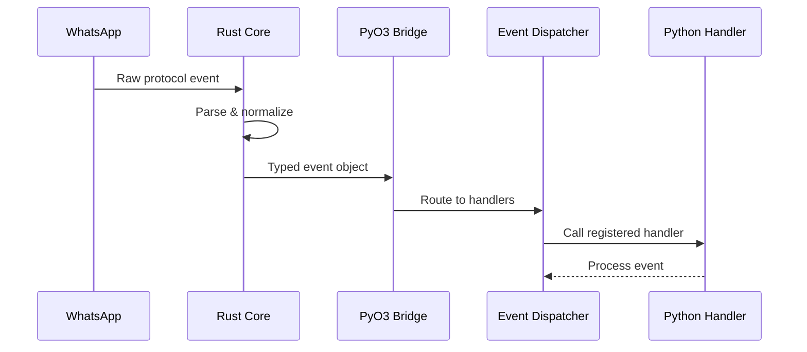
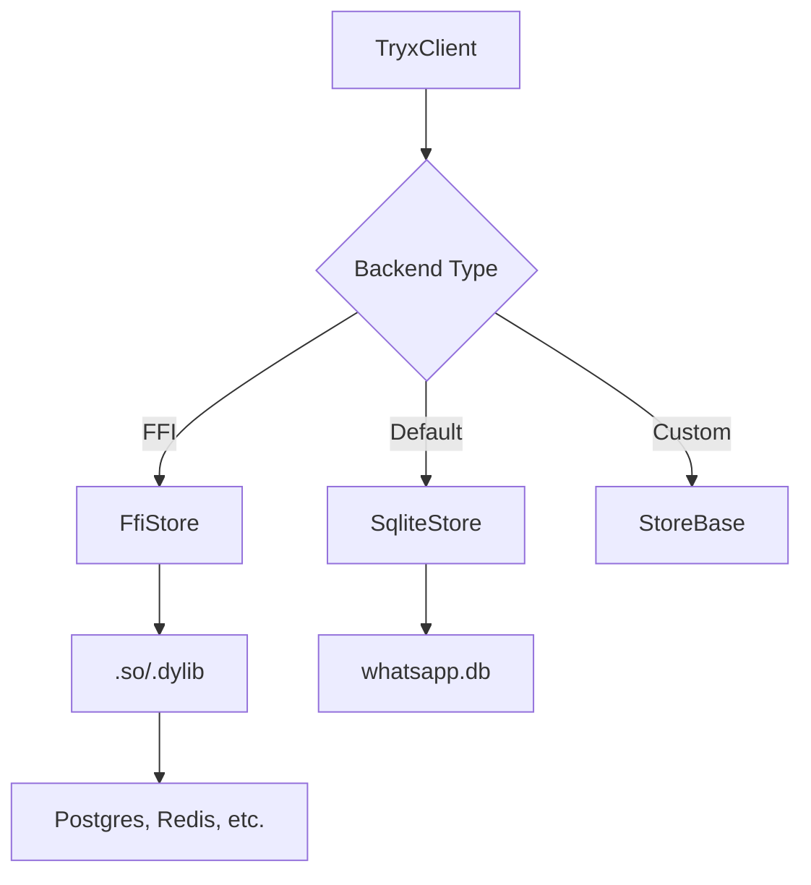

# Architecture

Tryx splits performance-sensitive protocol work (Rust) from application
ergonomics (Python). This gives you WhatsApp protocol handling at native
speed while keeping your bot logic simple and typed.

## Layered Design

```
┌──────────────────────────────────────────────────────┐
│                 Python Application                   │
│          (handlers, business logic, bots)            │
├──────────────────────────────────────────────────────┤
│                 Python API Layer                     │
│     TryxClient, namespace clients, @app.on()        │
│         (async methods, typed stubs)                │
├──────────────────────────────────────────────────────┤
│                 PyO3 Bridge                          │
│     GIL management, type conversion, error marshal  │
├──────────────────────────────────────────────────────┤
│                 Rust Core                            │
│   Protocol parsing, Signal crypto, media, transport │
│         (Noise, protobuf, tokio)                    │
└──────────────────────────────────────────────────────┘
```

### Rust Core Layer

The Rust side handles everything performance-sensitive:

| Module | Responsibility | Source |
|--------|---------------|--------|
| `src/clients/` | Client method implementations | `src/clients/tryx.rs`, `src/clients/groups.rs`, etc. |
| `src/events/` | Event dispatcher and event class definitions | `src/events/dispatcher.rs` |
| `src/types.rs` | Shared data classes (`JID`, `MessageInfo`, etc.) | `src/types.rs` |
| `src/backend/` | Storage backend bridge (SQLite, FFI, Python) | `src/backend/` |

Key Rust capabilities:

- **Protocol parsing** — WhatsApp binary protocol, protobuf messages, Noise handshake
- **Transport** — WebSocket connection, stream management, reconnection
- **Crypto** — Signal protocol (Double Ratchet, X3DH), end-to-end encryption
- **Media** — Upload/download, transcoding, thumbnail generation
- **Event normalization** — Raw protocol events → typed Python objects

### Python API Layer

The Python side provides ergonomics:

- **Namespace clients** — `client.groups`, `client.privacy`, `client.newsletter`, etc.
- **Event handlers** — Decorator-based callback registration via `@app.on(EventClass)`
- **Typed stubs** — `.pyi` files for IDE intelligence and static analysis
- **Storage backends** — SQLite (built-in), FFI (Postgres, etc.), pure Python

### PyO3 Bridge

The bridge layer handles type conversion between Python and Rust:

- **GIL management** — Uses `Python::attach()` (PyO3 0.28+) for lightweight GIL acquisition
- **Error marshaling** — Rust panics → Python `RuntimeError` / `panic::PanicException`
- **Async bridging** — `pyo3-async-runtimes` connects tokio to Python asyncio
- **Type conversion** — `JID`, `MessageProto`, `Node`, etc. converted via PyO3 extractors

---

## Data Flow

### Sending a Message


```mermaid
sequenceDiagram
    participant User as Python Code
    participant Client as TryxClient
    participant Bridge as PyO3 Bridge
    participant Rust as Rust Core
    participant WA as WhatsApp

    User->>Client: await client.send_text(jid, "hello")
    Client->>Bridge: Call Rust method
    Bridge->>Rust: Build protobuf message
    Rust->>Rust: Encrypt with Signal protocol
    Rust->>WA: Send over WebSocket
    WA-->>Rust: Server ACK
    Rust-->>Bridge: SendResult
    Bridge-->>User: SendResult
```

### Receiving an Event


```mermaid
sequenceDiagram
    participant WA as WhatsApp
    participant Rust as Rust Core
    participant Bridge as PyO3 Bridge
    participant Dispatcher as Event Dispatcher
    participant Handler as Python Handler

    WA->>Rust: Raw protocol event
    Rust->>Rust: Parse & normalize
    Rust->>Bridge: Typed event object
    Bridge->>Dispatcher: Route to handlers
    Dispatcher->>Handler: Call registered handler
    Handler-->>Dispatcher: Process event
```

---

## Storage Architecture

Tryx uses a pluggable storage backend for Signal protocol state:


```mermaid
graph TD
    A[TryxClient] --> B{Backend Type}
    B -->|Default| C[SqliteStore]
    B -->|FFI| D[FfiStore]
    B -->|Custom| E[StoreBase]
    D --> F[.so/.dylib]
    F --> G[Postgres, Redis, etc.]
    C --> H[whatsapp.db]
```

### Backend Selection

| Backend | Use Case | How It Works |
|---------|----------|--------------|
| `SqliteStore` | Default, zero-config | Built-in SQLite with WAL mode |
| `FfiStore` | High-performance | C ABI shared library loaded via `libloading` |
| `StoreBase` | Custom async | Pure Python, implement abstract methods |

The FFI backend is unique: Python never loads the `.so` directly. Python
only resolves the path and stores connection config — Tryx's Rust runtime
does the actual FFI loading.

---

## Module Map

| Path | Purpose |
|------|---------|
| `src/lib.rs` | Submodule registration and class exports |
| `src/clients/*.rs` | Client method implementations |
| `src/events/*` | Event classes and dispatcher |
| `src/types.rs` | Shared data classes |
| `src/wacore/*` | Low-level protocol models |
| `python/tryx/*.py` | Runtime re-export wrappers |
| `python/tryx/*.pyi` | Typed API contracts |

---

## Design Principles

### Protocol in Rust, Logic in Python

Keep protocol assumptions in Rust-backed typed models. Keep business policy
in Python handlers. This separation means:

- Protocol changes don't break your Python code
- Business logic changes don't require recompilation
- Performance-sensitive paths are always native

### Typed Contracts

Every Python-facing API has a `.pyi` stub file. This gives you:

- Editor autocomplete and type hints
- Static analysis with mypy/pyright
- Clear API documentation
- Runtime compatibility checking

### Event-Driven Architecture

All WhatsApp interactions flow through typed events:

```python
from tryx.events import EvMessage


@app.on(EvMessage)
async def handle_message(client, event: EvMessage):
    # event.sender, event.text, event.media, etc.
    pass
```

Events are structured classes, not ad-hoc dicts. This means:

- Guaranteed fields with correct types
- IDE support for event properties
- Clear documentation of what data is available

### Pluggable Storage

Storage is decoupled from the protocol engine:

- SQLite for development and single-instance deployments
- FFI shared libraries for high-throughput production
- Pure Python for exotic backends or rapid prototyping

All three tiers implement the same underlying Rust trait, so switching
backends requires only a change in the `Tryx()` constructor.

---

## Related

- [Event Model](event-model.md) — detailed event type reference
- [Type System](type-system.md) — shared data classes
- [Storage Backends](storage-backends.md) — backend comparison
- [Client API Gateway](../api/client.md) — namespace client reference
