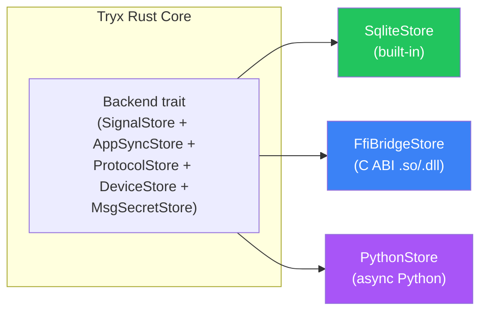
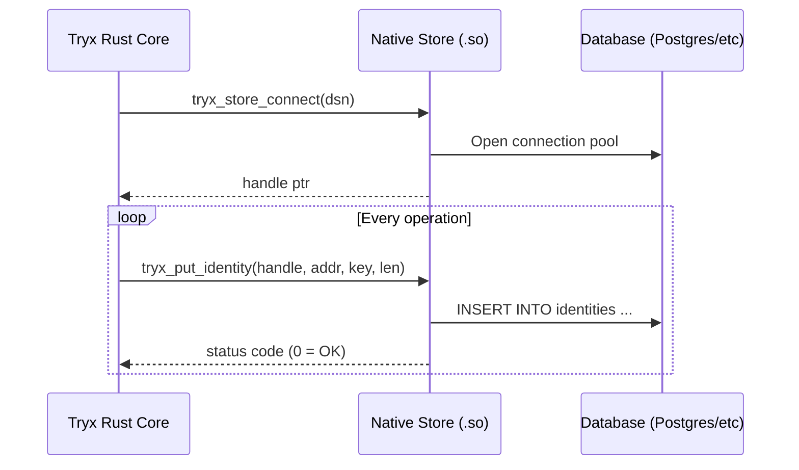
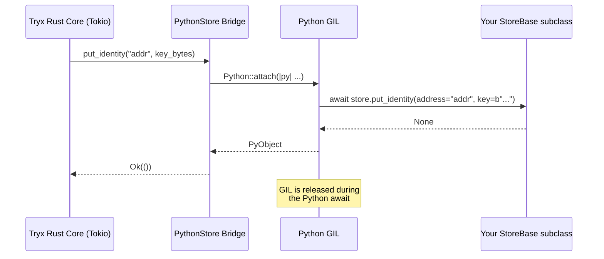

# Storage Backends

Tryx supports a **3-tier storage architecture** so you can pick the right balance between simplicity, performance, and flexibility for your project.

| Tier | Backend | Language | Overhead | When to use |
|------|---------|----------|----------|-------------|
| 1 | `SqliteStore` | Built-in (Rust) | Zero | Default / prototyping / single-instance |
| 2 | FFI Store | Native (C ABI) | Near-zero | Maximum throughput (Postgres, custom C/Rust) |
| 3 | `StoreBase` | Pure Python | Low | Rapid development / exotic backends (Redis, Mongo) |



---

## Tier 1: SqliteStore (Default)

The built-in SQLite backend requires zero configuration. Just pass a file path:

```python
from tryx.backend import SqliteStore
from tryx.client import Tryx

app = Tryx(SqliteStore("whatsapp.db"))
```

Internally, the Rust core opens the database with WAL mode, creates all tables automatically, and handles migrations. This is the recommended backend for development and single-instance production deployments.

---

## Tier 2: FFI Store (Native Shared Library)

For maximum throughput with no Python overhead, implement a storage backend as a native shared library (`.so` / `.dylib` / `.dll`) that exports C-ABI entry points.

### Architecture



### Usage

Any object with `lib_path` and `connect_string` attributes is detected as an FFI backend:

```python
from tryx.client import Tryx


# tryx-store-postgres exposes this interface
class PostgresStore:
    lib_path = "./libtryx_pg.so"
    connect_string = "host=localhost dbname=tryx"


app = Tryx(PostgresStore())
```

### Type Safety

Use the `FfiStoreProtocol` for type checking:

```python
from tryx.backend import FfiStoreProtocol


def create_backend() -> FfiStoreProtocol:
    return PostgresStore()  # type checker validates attributes
```

### Required C ABI Entry Points

Your shared library must export these symbols:

| Symbol | Signature |
|--------|-----------|
| `tryx_store_connect` | `(dsn: *const c_char, handle: *mut *mut c_void) -> i32` |
| `tryx_store_destroy` | `(handle: *mut c_void)` |
| `tryx_put_identity` | `(handle, addr, key_ptr, key_len) -> i32` |
| `tryx_load_identity` | `(handle, addr, out: *mut TryxBuffer) -> i32` |
| `tryx_delete_identity` | `(handle, addr) -> i32` |
| ... | (see `ffi_bridge.rs` for the full list of ~30 entry points) |

All functions return `0` on success, non-zero on error.

---

## Tier 3: PythonStore (Pure Python)

For maximum flexibility, inherit from `StoreBase` and implement all abstract methods using any async Python library.

### Architecture



### Usage

```python
import json
import redis.asyncio as redis
from tryx.backend import StoreBase
from tryx.client import Tryx


class RedisStore(StoreBase):
    def __init__(self, url: str = "redis://localhost"):
        self.r = redis.from_url(url)

    async def put_identity(self, address: str, key: bytes) -> None:
        await self.r.set(f"identity:{address}", key)

    async def load_identity(self, address: str) -> bytes | None:
        return await self.r.get(f"identity:{address}")

    async def delete_identity(self, address: str) -> None:
        await self.r.delete(f"identity:{address}")

    # ... implement ALL abstract methods from StoreBase ...


app = Tryx(RedisStore())
```

### Type Checking

`StoreBase` is an `ABC` with `@abstractmethod` on every required method. If you miss any method:

- **Mypy/Pyright** will report an error at class definition
- **Runtime** will raise `TypeError: Can't instantiate abstract class`

```python
class IncompleteStore(StoreBase):
    async def put_identity(self, address: str, key: bytes) -> None:
        pass

    # Missing 50+ methods → type checker error!
```

### Performance Characteristics

The PythonStore bridge is designed for low overhead:

| Aspect | Detail |
|--------|--------|
| **GIL acquisition** | Uses `Python::attach()` (PyO3 0.28+), the lightest available mechanism |
| **Async bridging** | `pyo3_async_runtimes::tokio::into_future()` — zero-copy future conversion |
| **Argument passing** | Scalars (`str`, `int`, `bool`) passed natively via kwargs; complex structs as JSON bytes |
| **GIL during I/O** | Released during Python `await` — other Rust tasks run freely |
| **Cloning** | `Py<T>::clone_ref()` — reference count increment only, no deep copy |

**Typical overhead per call:** ~2-5µs for GIL acquire/release + Python method dispatch. The actual database I/O dominates.

---

## API Specification

All three tiers implement the same underlying Rust traits. Here is the complete method reference grouped by trait:

### SignalStore — End-to-End Encryption

Handles identity keys, sessions, pre-keys, signed pre-keys, and sender keys.

| Method | Args | Returns | Description |
|--------|------|---------|-------------|
| `put_identity` | `address: str, key: bytes` | `None` | Store 32-byte identity key |
| `load_identity` | `address: str` | `bytes \| None` | Load identity key (32 bytes) |
| `delete_identity` | `address: str` | `None` | Delete identity key |
| `get_session` | `address: str` | `bytes \| None` | Get encrypted session record |
| `put_session` | `address: str, session: bytes` | `None` | Store session record |
| `delete_session` | `address: str` | `None` | Delete session |
| `store_prekey` | `id: int, record: bytes, uploaded: bool` | `None` | Store pre-key |
| `load_prekey` | `id: int` | `bytes \| None` | Load pre-key |
| `remove_prekey` | `id: int` | `None` | Remove pre-key |
| `get_max_prekey_id` | — | `int` | Max stored pre-key ID (or 0) |
| `store_signed_prekey` | `id: int, record: bytes` | `None` | Store signed pre-key |
| `load_signed_prekey` | `id: int` | `bytes \| None` | Load signed pre-key |
| `load_all_signed_prekeys` | — | `list[tuple[int, bytes]]` | All signed pre-keys |
| `remove_signed_prekey` | `id: int` | `None` | Remove signed pre-key |
| `put_sender_key` | `address: str, record: bytes` | `None` | Store group sender key |
| `get_sender_key` | `address: str` | `bytes \| None` | Get group sender key |
| `delete_sender_key` | `address: str` | `None` | Delete group sender key |

### AppSyncStore — App State Synchronization

| Method | Args | Returns | Description |
|--------|------|---------|-------------|
| `get_sync_key` | `key_id: bytes` | `bytes \| None` | Get sync key (JSON `AppStateSyncKey`) |
| `set_sync_key` | `key_id: bytes, key: bytes` | `None` | Set sync key |
| `get_version` | `name: str` | `bytes` | Get collection version (JSON `HashState`) |
| `set_version` | `name: str, state: bytes` | `None` | Set collection version |
| `put_mutation_macs` | `name: str, version: int, mutations: bytes` | `None` | Store mutation MACs |
| `get_mutation_mac` | `name: str, index_mac: bytes` | `bytes \| None` | Get mutation MAC |
| `delete_mutation_macs` | `name: str, index_macs: bytes` | `None` | Delete mutation MACs |
| `get_latest_sync_key_id` | — | `bytes \| None` | Latest sync key ID |

### DeviceStore — Device Persistence

| Method | Args | Returns | Description |
|--------|------|---------|-------------|
| `save` | `device: bytes` | `None` | Save device data (JSON `Device`) |
| `load` | — | `bytes \| None` | Load device data |
| `exists` | — | `bool` | Check if device exists |
| `create` | — | `int` | Create device, return ID |

### ProtocolStore — Protocol Alignment

| Method | Args | Returns | Description |
|--------|------|---------|-------------|
| `get_sender_key_devices` | `group_jid: str` | `list[tuple[str, bool]]` | SKDM device status |
| `set_sender_key_status` | `group_jid: str, entries: bytes` | `None` | Set SKDM status |
| `clear_sender_key_devices` | `group_jid: str` | `None` | Clear group SKDM tracking |
| `delete_sender_key_device_rows` | `device_jids: bytes` | `None` | Delete by device JID |
| `clear_all_sender_key_devices` | — | `None` | Clear all SKDM tracking |
| `get_lid_mapping` | `lid: str` | `bytes \| None` | LID→PN mapping (JSON) |
| `get_pn_mapping` | `phone: str` | `bytes \| None` | PN→LID mapping (JSON) |
| `put_lid_mapping` | `entry: bytes` | `None` | Upsert LID-PN mapping |
| `get_all_lid_mappings` | — | `list[bytes]` | All mappings (JSON array) |
| `save_base_key` | `address: str, message_id: str, base_key: bytes` | `None` | Retry collision detection |
| `has_same_base_key` | `address: str, message_id: str, current_base_key: bytes` | `bool` | Compare base keys |
| `delete_base_key` | `address: str, message_id: str` | `None` | Delete base key |
| `update_device_list` | `record: bytes` | `None` | Update device registry (JSON) |
| `get_devices` | `user: str` | `bytes \| None` | Get device list (JSON) |
| `delete_devices` | `user: str` | `None` | Delete device list |
| `get_tc_token` | `jid: str` | `bytes \| None` | Get trust token (JSON) |
| `put_tc_token` | `jid: str, entry: bytes` | `None` | Set trust token |
| `delete_tc_token` | `jid: str` | `None` | Delete trust token |
| `get_all_tc_token_jids` | — | `list[str]` | All JIDs with tokens |
| `delete_expired_tc_tokens` | `cutoff: int` | `int` | Prune old tokens |
| `store_sent_message` | `chat_jid: str, message_id: str, payload: bytes` | `None` | Store for retry |
| `take_sent_message` | `chat_jid: str, message_id: str` | `bytes \| None` | Atomic take |
| `delete_expired_sent_messages` | `cutoff: int` | `int` | Prune old messages |

### MsgSecretStore — Message Secret Persistence

| Method | Args | Returns | Description |
|--------|------|---------|-------------|
| `put_msg_secrets` | `entries: bytes` | `int` | Batch upsert (JSON `[MsgSecretEntry]`) |
| `get_msg_secret` | `chat: str, sender: str, msg_id: str` | `bytes \| None` | Fetch secret |
| `delete_expired_msg_secrets` | `cutoff: int` | `int` | Prune expired secrets |

---

## JSON Struct Schemas

Complex types are passed as JSON bytes. Here are the key schemas:

### AppStateSyncKey

```json
{
  "key_data": [/* u8 array */],
  "fingerprint": [/* u8 array */],
  "timestamp": 1717430400
}
```

### LidPnMappingEntry

```json
{
  "lid": "100000012345678",
  "phone_number": "559980000001",
  "created_at": 1717430400,
  "updated_at": 1717430400,
  "learning_source": "usync"
}
```

### TcTokenEntry

```json
{
  "token": [/* u8 array */],
  "token_timestamp": 1717430400,
  "sender_timestamp": 1717430400
}
```

### MsgSecretEntry

```json
{
  "chat": "5599800001@s.whatsapp.net",
  "sender": "5599800002@s.whatsapp.net",
  "msg_id": "3EB0A1B2C3D4E5F6",
  "secret": [/* 32 u8 bytes */],
  "expires_at": 0,
  "message_ts": 1717430400
}
```

### DeviceListRecord

```json
{
  "user": "559980000001",
  "devices": [
    {"device_id": 0, "key_index": null},
    {"device_id": 1, "key_index": 42}
  ],
  "timestamp": 1717430400,
  "phash": "abc123",
  "raw_id": 5
}
```

---

## Choosing a Backend

| Criteria | SqliteStore | FFI Store | PythonStore |
|----------|:-----------:|:---------:|:-----------:|
| Setup complexity | ⭐ Zero | ⭐⭐⭐ Requires compilation | ⭐⭐ Moderate |
| Throughput | ⭐⭐ Good | ⭐⭐⭐ Maximum | ⭐⭐ Good |
| Multi-instance | ❌ Single file | ✅ Shared DB | ✅ Shared DB |
| Language | Rust (built-in) | C/Rust | Python |
| Development speed | ⭐⭐⭐ Instant | ⭐ Slow | ⭐⭐⭐ Fast |
| Package decoupling | Built-in | ✅ Fully independent | ✅ Fully independent |
