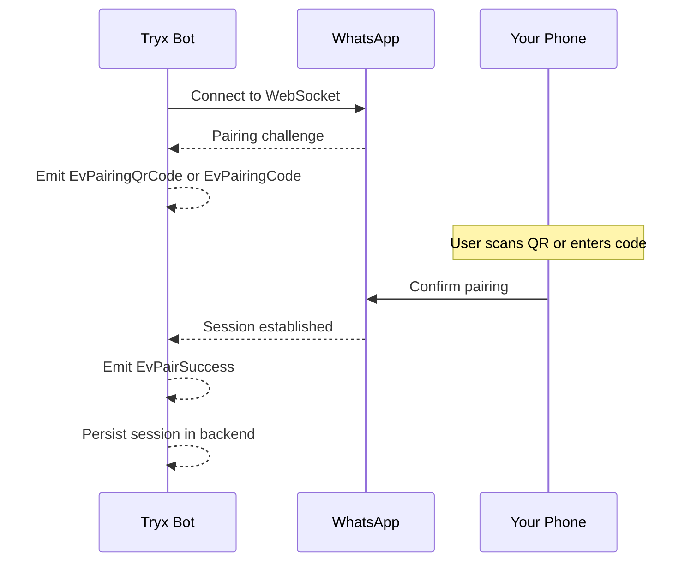

# Authentication Flow

Tryx follows the WhatsApp multi-device pairing flow. The first run links
a session, and later runs reuse stored state.

!!! note "Key principle"
    Authentication stability is mostly a storage and ownership problem.
    Treat backend/session files as critical runtime state.

---

## Pairing Modes

| Mode | Event | How to Use |
|------|-------|------------|
| **QR Code** | `EvPairingQrCode` | Scan with your phone camera |
| **Numeric Code** | `EvPairingCode` | Enter 8-digit code on your phone |

---

## First-Run Sequence



1. Start client runtime
2. Wait for `EvPairingQrCode` or `EvPairingCode`
3. Complete pairing from your WhatsApp mobile app
4. Receive `EvPairSuccess`
5. Session credentials are persisted in your backend

---

## Event Reference

| Event | Meaning | Action |
|-------|---------|--------|
| `EvPairingQrCode` | QR challenge issued | Display QR to user |
| `EvPairingCode` | Code-based pairing challenge | Display code to user |
| `EvPairSuccess` | Session linked and persisted | Continue normal operations |
| `EvPairError` | Pairing rejected/failed | Inspect logs and retry |

---

## Code Example: Pairing Handler

```python
from tryx.client import Tryx
from tryx.backend import SqliteStore
from tryx.events import (
    EvPairingQrCode,
    EvPairingCode,
    EvPairSuccess,
    EvPairError,
)

backend = SqliteStore("whatsapp.db")
app = Tryx(backend)


@app.on(EvPairingQrCode)
async def on_qr(client, event):
    print(f"Scan this QR code: {event.qr_data}")
    # In a real bot, you might send this to a web interface


@app.on(EvPairingCode)
async def on_code(client, event):
    print(f"Enter this code: {event.pairing_code}")


@app.on(EvPairSuccess)
async def on_success(client, event):
    print("Successfully paired!")


@app.on(EvPairError)
async def on_error(client, event):
    print(f"Pairing failed: {event.error}")
```

---

## Persistence

Use a stable backend path:

```python
from tryx.backend import SqliteStore

backend = SqliteStore("/srv/tryx/session.db")
```

If the same backend path is reused, you usually do not need to pair again.

!!! warning "Single writer rule"
    Avoid multiple runtime instances writing to the same backend path
    unless you explicitly control ownership.

---

## Recovery Signals

| Event | Meaning | Action |
|-------|---------|--------|
| `EvLoggedOut` | Session invalidated | Re-pair and rotate session artifacts |
| `EvStreamReplaced` | Another login replaced your stream | Check for duplicate sessions |
| `EvTemporaryBan` | Temporary restrictions detected | Pause high-volume operations |

---

## Recovery Playbook

### `EvLoggedOut`

```python
@app.on(EvLoggedOut)
async def on_logged_out(client):
    logger.warning("Session invalidated, re-pairing required")
    # Stop bot operations
    # Notify operator
    # Trigger re-pairing flow
```

### `EvStreamReplaced`

```python
@app.on(EvStreamReplaced)
async def on_replaced(client):
    logger.warning("Stream replaced by another session")
    # Check if another deployment is using the same account
    # Ensure single-writer backend ownership
```

### `EvTemporaryBan`

```python
@app.on(EvTemporaryBan)
async def on_ban(client, event):
    logger.warning(f"Temporary ban: {event.reason}")
    # Stop automation burst traffic
    # Re-enable gradually after ban period
```

---

## Operational Guidance

- Keep one active session owner for a backend path
- Avoid deleting backend files unless resetting account link is intentional
- Back up backend data before infrastructure migration
- Monitor for `EvStreamReplaced` to detect duplicate sessions

---

## Related

- [Deployment Guide](../operations/deployment.md) — production setup
- [Troubleshooting](../operations/troubleshooting.md) — connection issues
- [Reliability](../operations/reliability.md) — error handling patterns
