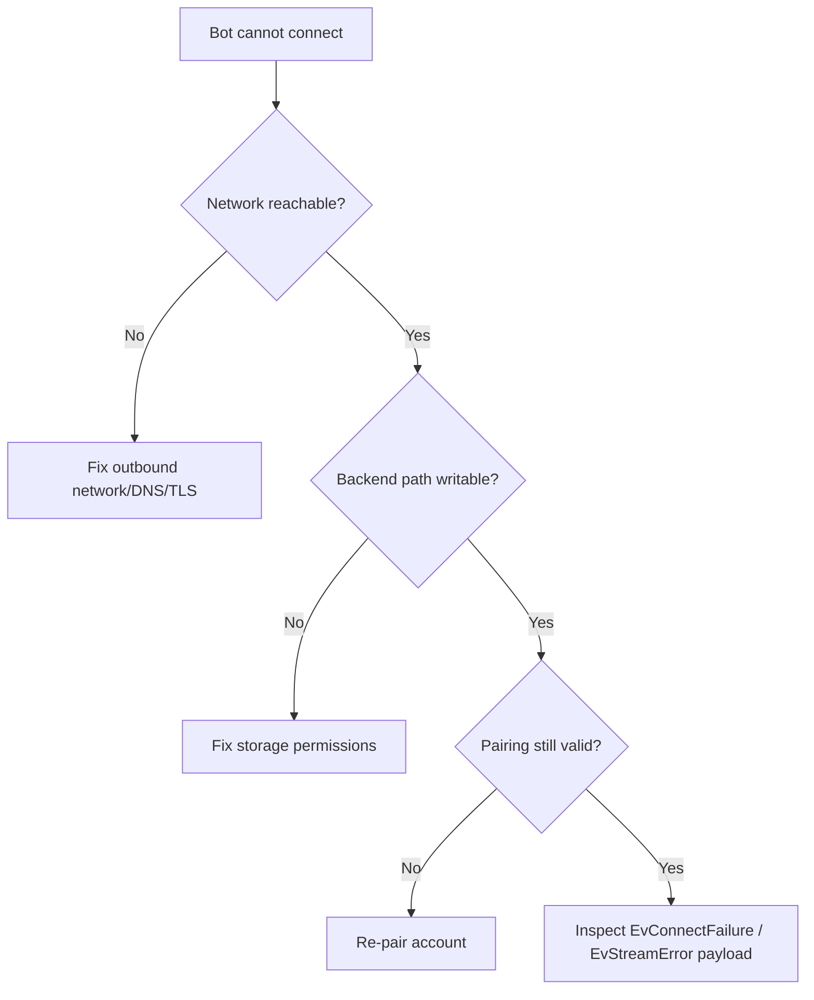

# Troubleshooting

Use this page as a decision tree first, checklist second.

## Connection Decision Tree



!!! danger "Always check first"
	1. outbound network
	2. backend storage write access
	3. session validity

## Frequent Reconnects

Possible causes:

- unstable network
- another active session replacing stream (`EvStreamReplaced`)
- backend corruption or stale state

### Action Path

1. log reconnect timestamp and reason event
2. verify if replacement is expected (another device/session)
3. isolate backend path ownership to single runtime instance

## Message Send Fails

### Fast Checklist

- validate `JID` target format
- ensure `client.is_connected()` is true
- verify protobuf payload shape if using `send_message`
- classify exception (`PyPayloadBuildError` vs `EventDispatchError`)

```python
try:
	await client.send_text(chat_jid, "hello")
except PyPayloadBuildError:
	# payload/content issue
	...
except EventDispatchError:
	# dispatch/runtime issue
	...
```

## Media Download Fails

1. verify media subtype object (image/video/audio/etc.)
2. if direct path expired, call `request_media_reupload(...)`
3. retry with bounded attempt count

!!! tip "Audit fields"
	Log `message_id`, `chat_jid`, and retry counter for every reupload attempt.

## Sync Events Are Confusing

Sync events are normal in multi-device behavior.

Treat `EvArchiveUpdate`, `EvMarkChatAsReadUpdate`, and `EvDeleteChatUpdate` as state convergence signals.

## Escalation Path

If issue persists:

1. capture event type + metadata snapshot
2. capture backend health and storage checks
3. reduce to minimal reproducible handler
4. compare against [QnA](../faq/qna.md) and [Error Handling](../reference/error-handling.md)
